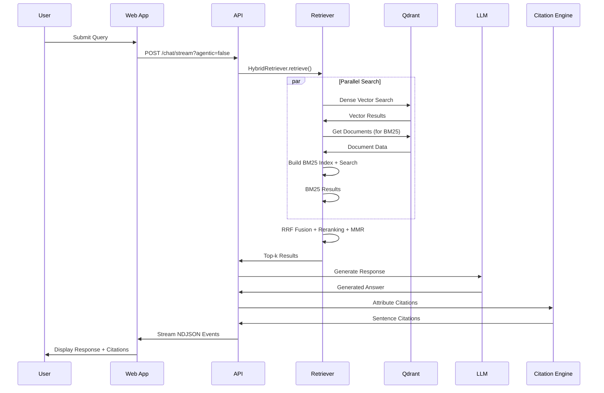
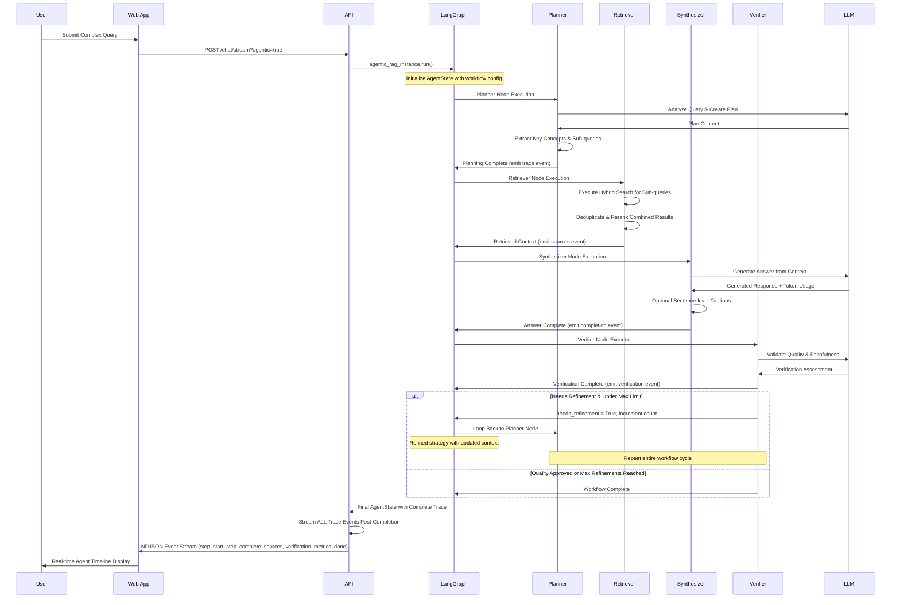

# MAI Storage - System Architecture

**Version**: Phase 12 Complete  
**Last Updated**: January 2025  
**System Status**: Production-Ready Agentic RAG Platform

## Overview

MAI Storage is an enterprise-grade **Agentic RAG (Retrieval Augmented Generation)** system that combines traditional retrieval techniques with intelligent multi-step reasoning workflows. Built with Next.js, FastAPI, and LangGraph, the system provides both Traditional and Agentic RAG capabilities with comprehensive evaluation, monitoring, and deployment infrastructure.

## Core Architecture Principles

### 🎯 **Agentic vs Traditional RAG**
- **Traditional RAG**: Single-pass Query → Retrieve → Generate → Cite
- **Agentic RAG**: Multi-step Planner → Retrieve → Synthesize → Verifier → Refine

### 🏗️ **Microservices Design**
- **Frontend**: Next.js 14 with streaming UI and real-time trace visualization
- **Backend**: FastAPI with async processing and comprehensive middleware
- **Infrastructure**: Docker Compose orchestration with production monitoring

### 🔄 **Event-Driven Architecture**
- **Streaming**: NDJSON events for real-time user feedback
- **Tracing**: Complete workflow visibility with step-by-step execution logs
- **Monitoring**: Prometheus metrics and structured logging

---

## System Components

### 🌐 Frontend Architecture (`apps/web/`)

#### Next.js Application Structure
```
apps/web/
├── pages/
│   ├── chat.js                 # Main chat interface
│   ├── eval.js                 # Evaluation dashboard
│   ├── index.js                # Landing page
│   └── api/
│       └── chat/stream.js      # Proxy to FastAPI
├── src/components/
│   ├── ChatInput.js            # User input component
│   ├── ChatStream.js           # Streaming response handler
│   ├── AgentTrace.js           # Workflow visualization
│   ├── ContextPanel.js         # Source document display
│   ├── ModeToggle.js           # Traditional vs Agentic toggle
│   └── SourceBadge.js          # Citation hover cards
└── styles/
    └── globals.css             # Tailwind + custom styles
```

#### Key Features
- **Streaming Interface**: Real-time token streaming with NDJSON parsing
- **Dual Mode Support**: Toggle between Traditional and Agentic RAG
- **Citation Visualization**: Sentence-level citations with hover previews
- **Agent Trace Panel**: Step-by-step workflow execution timeline
- **Dark Mode**: Persistent user preference with system detection

#### Data Flow


### 🚀 Backend Architecture (`services/rag_api/`)

#### FastAPI Application Structure
```
services/rag_api/
├── main.py                     # FastAPI app with middleware stack
├── models.py                   # Pydantic data models
├── graph.py                    # LangGraph agentic workflow
├── rag_baseline.py             # Traditional RAG implementation
├── retrieval.py                # Hybrid retrieval engine
├── citer.py                    # Sentence-level citation engine
├── llm_client.py               # OpenAI client wrapper
├── monitoring.py               # Prometheus metrics
├── middleware.py               # Security & performance middleware
├── logging_config.py           # Structured logging setup
├── tools.py                    # Utility functions
├── cache.py                    # Multi-layer caching
├── context_condenser.py        # Context optimization
├── prompts/                    # LLM prompt templates
│   ├── baseline.py
│   ├── planner.py
│   └── verifier.py
└── eval/                       # Evaluation framework
    └── run_ragas.py            # RAGAS metrics evaluation
```

#### Core Services

##### 1. **Hybrid Retrieval Engine** (`retrieval.py`)
- **Dense Search**: OpenAI `text-embedding-3-small` with Qdrant vectors
- **Sparse Search**: In-memory BM25 scoring with TF-IDF algorithms
- **Sparse Search**: In-memory BM25 scoring with TF-IDF algorithms
- **Fusion**: Reciprocal Rank Fusion (RRF) for optimal ranking
- **Reranking**: BGE-reranker-v2 cross-encoder for precision
- **Diversification**: Maximal Marginal Relevance (MMR) for variety

```python
# Retrieval Pipeline
query → embed → [dense_search, bm25_search] → rrf_fusion → rerank → mmr → results
```

##### 2. **Agentic Workflow Engine** (`graph.py`)
Built with LangGraph StateGraph for complex multi-step reasoning:


**Agent Components**:
- **Planner**: Query decomposition, key concept extraction, search strategy
- **Retriever**: Executes hybrid search based on plan
- **Synthesizer**: Generates comprehensive answers from multiple sources
- **Verifier**: Validates faithfulness, coverage, and quality
- **Citation Engine**: Sentence-level attribution with confidence scoring

##### 3. **Traditional RAG System** (`rag_baseline.py`)
Single-pass implementation for baseline comparison:
```python
query → retrieve → context_assembly → llm_generate → chunk_citations
```

##### 4. **Citation Engine** (`citer.py`)
Sentence-level attribution system:
- **Post-hoc Attribution**: Sentence embeddings mapped to supporting chunks
- **Confidence Scoring**: Cosine similarity with thresholds
- **Text Span Highlighting**: Precise source location marking
- **Low-confidence Warning**: ⚠️ markers for uncertain claims

#### Middleware Stack

##### Security & Performance (`middleware.py`)
```python
SecurityHeadersMiddleware()      # CORS, CSP, HSTS, XSS protection
RateLimitMiddleware()           # Request throttling per IP
RequestSizeLimitMiddleware()    # Payload size protection
CircuitBreakerMiddleware()      # Dependency failure isolation
ErrorBoundaryMiddleware()       # Graceful error handling
```

##### Monitoring & Observability (`monitoring.py`, `logging_config.py`)
- **Structured Logging**: JSON format with correlation IDs
- **Prometheus Metrics**: Request latency, token usage, cache hit rates
- **Performance Tracking**: P50/P95 latency, memory usage, CPU utilization
- **Health Checks**: Multi-level validation with dependency status

### 🗃️ Data Layer

#### Vector Database (Qdrant)
```yaml
Configuration:
  Collection: mai_storage_vectors
  Vector Size: 1536 (text-embedding-3-small)
  Distance: Cosine
  HNSW Parameters:
    M: 48              # Graph connectivity
    efConstruction: 256 # Index building accuracy
    efSearch: 128      # Query time accuracy
```

#### Search Infrastructure (In-Memory BM25)
#### Search Infrastructure (In-Memory BM25)
```yaml
BM25 Configuration:
  k1: 1.2           # Term frequency saturation
  b: 0.75           # Length normalization
  Implementation: In-memory TF-IDF
  Index: Built dynamically from Qdrant documents
  Performance: <1ms for cached queries
  Persistence: Memory-based with LRU caching
  Implementation: In-memory TF-IDF
  Index: Built dynamically from Qdrant documents
  Performance: <1ms for cached queries
  Persistence: Memory-based with LRU caching
```

#### Caching Architecture (`cache.py`)
**5-Layer Caching Strategy**:
1. **Query Embedding Cache**: Redis with 24h TTL
2. **Candidate Cache**: Top-100 candidates with 1h TTL  
3. **Reranker Cache**: Cross-encoder scores with 6h TTL
4. **LLM Response Cache**: Generated answers with 24h TTL
5. **Prompt Template Cache**: In-memory compiled templates

---

## Data Flow Architecture

### Traditional RAG Workflow


### Agentic RAG Workflow


---

## Model Configuration

### LLM Configuration
```yaml
Primary Model: gpt-4o-mini
Usage:
  - Baseline RAG Generation
  - Agentic Planner Node
  - Agentic Synthesizer Node  
  - Agentic Verifier Node
  
Temperature: 0.7
Max Tokens: 4096
Timeout: 30s
Retry Strategy: Exponential backoff (3 attempts)
```

### Embedding Model
```yaml
Model: text-embedding-3-small
Dimensions: 1536
Usage:
  - Document Chunking
  - Query Embedding
  - Citation Attribution
  
Batch Size: 100
Cache TTL: 24h
Normalization: L2 (for cosine similarity)
```

### Reranking Model  
```yaml
Model: bge-reranker-v2-m3
Type: Cross-encoder
Usage: Final candidate reranking
Top Candidates: 100 → 15
Batch Size: 32
Device: CPU (ONNX optimized)
```

---

## Performance Characteristics

### Latency Targets
```yaml
Traditional RAG:
  P50: <400ms
  P95: <800ms
  
Agentic RAG:
  P50: <1200ms  
  P95: <2500ms
  
Retrieval Only:
  P50: <200ms
  P95: <400ms
```

### Throughput Capacity
```yaml
Concurrent Users: 50+
Requests/Second: 100+
Cache Hit Rate: 85%+
Memory Usage: <2GB
CPU Usage: <70%
```

### Quality Metrics
```yaml
RAGAS Scores:
  Faithfulness: >0.85
  Answer Relevancy: >0.80
  Context Precision: >0.75
  Context Recall: >0.70

Retrieval Metrics:
  Recall@10: >0.85
  nDCG@10: >0.75
  MRR: >0.70
```

---

## Deployment Architecture

### Development Environment
```bash
# Local Development Stack
make setup              # Environment configuration
make start-infra        # Qdrant only (BM25 in-memory)
make start-infra-full   # Qdrant + Elasticsearch (optional)
make start-infra        # Qdrant only (BM25 in-memory)
make start-infra-full   # Qdrant + Elasticsearch (optional)
make start-api         # FastAPI development server
make start-web         # Next.js development server
```

### Production Deployment

#### Container Architecture
```yaml
Services:
  - web-app:           # Next.js on Vercel
      replicas: auto-scale
      domain: app.maistorage.com
      
  - rag-api:           # FastAPI on Docker
      replicas: 3
      port: 8000
      health: /health
      
  - qdrant:            # Vector database
      replicas: 1
      persistence: enabled
      port: 6333
      
  - elasticsearch:     # Search engine (optional - for enhanced BM25)
  - elasticsearch:     # Search engine (optional - for enhanced BM25)
      replicas: 1  
      persistence: enabled
      port: 9200
      profiles: optional
      profiles: optional
      
  - prometheus:        # Metrics collection
      replicas: 1
      port: 9090
```

#### Infrastructure Components
```yaml
Load Balancer: nginx/Traefik
SSL: Let's Encrypt
Monitoring: Prometheus + Grafana
Logging: ELK Stack
Backup: Automated Qdrant snapshots
Auto-scaling: CPU/Memory based
```

---

## Security Architecture

### Authentication & Authorization
- **API Keys**: OpenAI API key management
- **Rate Limiting**: Per-IP request throttling
- **Input Validation**: Pydantic model validation
- **Size Limits**: Request payload protection

### Data Security
- **Privacy**: No persistent user data storage
- **Encryption**: TLS 1.3 for all communications
- **Secrets**: Environment variable management
- **Audit**: Comprehensive request logging

### Security Headers
```yaml
Content-Security-Policy: strict-dynamic
X-Frame-Options: DENY
X-Content-Type-Options: nosniff
Strict-Transport-Security: max-age=31536000
X-XSS-Protection: 1; mode=block
```

---

## Monitoring & Observability

### Metrics Collection
```yaml
Application Metrics:
  - Request latency (P50, P95, P99)
  - Token usage and costs
  - Cache hit rates
  - Error rates and types
  
System Metrics:
  - CPU and memory usage
  - Disk I/O and storage
  - Network throughput
  - Database connections
  
Business Metrics:
  - Query complexity distribution
  - Agentic vs Traditional usage
  - Citation accuracy rates
  - User satisfaction indicators
```

### Alerting Strategy
```yaml
Critical Alerts:
  - API downtime (>1 minute)
  - High error rate (>5%)
  - Memory usage (>80%)
  - Response time degradation (>2x baseline)
  
Warning Alerts:
  - Cache hit rate drop (<70%)
  - Queue depth increase
  - Dependency health issues
  - Unusual traffic patterns
```

### Logging Framework
```yaml
Format: Structured JSON
Fields:
  - timestamp
  - correlation_id
  - level (INFO/WARN/ERROR)
  - service
  - endpoint
  - user_agent
  - processing_time
  - token_usage
  - cache_status
  - error_details
```

---

## Quality Assurance

### Testing Strategy
```yaml
Unit Tests: 53 tests (100% passing)
  - Text splitters and chunking logic
  - Retrieval algorithms (RRF, MMR, BM25)
  - Citation engine attribution
  
Integration Tests: End-to-end workflows
  - Traditional RAG pipeline
  - Agentic workflow execution
  - Streaming response handling
  
Edge Case Tests: Robustness validation
  - Ambiguous acronyms
  - Typos and misspellings
  - Conflicting information
  - Malformed inputs
  
Performance Tests: Load and latency
  - Concurrent user simulation
  - Memory usage monitoring
  - Cache performance validation
```

### Evaluation Framework
```yaml
RAGAS Metrics:
  - Faithfulness: LLM hallucination detection
  - Answer Relevancy: Query-response alignment
  - Context Precision: Relevant chunks in top-k
  - Context Recall: Coverage of ground truth
  
Retrieval Metrics:
  - Recall@k: Relevant documents retrieved
  - nDCG@k: Ranking quality assessment
  - MRR: Mean reciprocal rank
  
Citation Metrics:
  - Attribution accuracy
  - Confidence calibration
  - Text span precision
```

---

## Scalability Considerations

### Horizontal Scaling
- **Stateless API**: Multiple FastAPI replicas
- **Database Scaling**: Qdrant cluster mode
- **Cache Distribution**: Redis cluster
- **Load Balancing**: Round-robin with health checks

### Vertical Scaling
- **Memory Optimization**: Efficient embedding storage
- **CPU Optimization**: ONNX model acceleration
- **I/O Optimization**: Async processing throughout
- **Network Optimization**: Connection pooling

### Future Enhancements
- **Multi-language Support**: International embeddings
- **Advanced Chunking**: Semantic boundary detection
- **Hybrid Models**: Local + Cloud LLM orchestration
- **Real-time Updates**: Live document indexing
- **Advanced Analytics**: User behavior insights

---

## Technology Stack Summary

### Core Technologies
```yaml
Frontend:
  - Framework: Next.js 14 (Pages Router)
  - Styling: Tailwind CSS + shadcn/ui
  - State: React hooks + localStorage
  - Streaming: Fetch API + ReadableStream
  
Backend:
  - Framework: FastAPI + Uvicorn
  - Async: asyncio + aiohttp
  - Workflow: LangGraph StateGraph
  - Validation: Pydantic v2
  
AI/ML:
  - LLM: OpenAI GPT-4o-mini
  - Embeddings: text-embedding-3-small
  - Reranker: BGE-reranker-v2-m3
  - Framework: LangChain components
  
Data:
  - Vector DB: Qdrant
  - Search: In-memory BM25 (Elasticsearch optional)
  - Search: In-memory BM25 (Elasticsearch optional)
  - Cache: Redis (production)
  - Memory: In-memory (development)
  
Infrastructure:
  - Containers: Docker + Compose
  - Monitoring: Prometheus + Grafana
  - Deployment: Vercel (web) + Docker (api)
  - CI/CD: GitHub Actions
```

---

This architecture provides a robust, scalable, and maintainable foundation for enterprise-grade agentic RAG applications, combining cutting-edge AI capabilities with production-ready infrastructure and comprehensive quality assurance.
