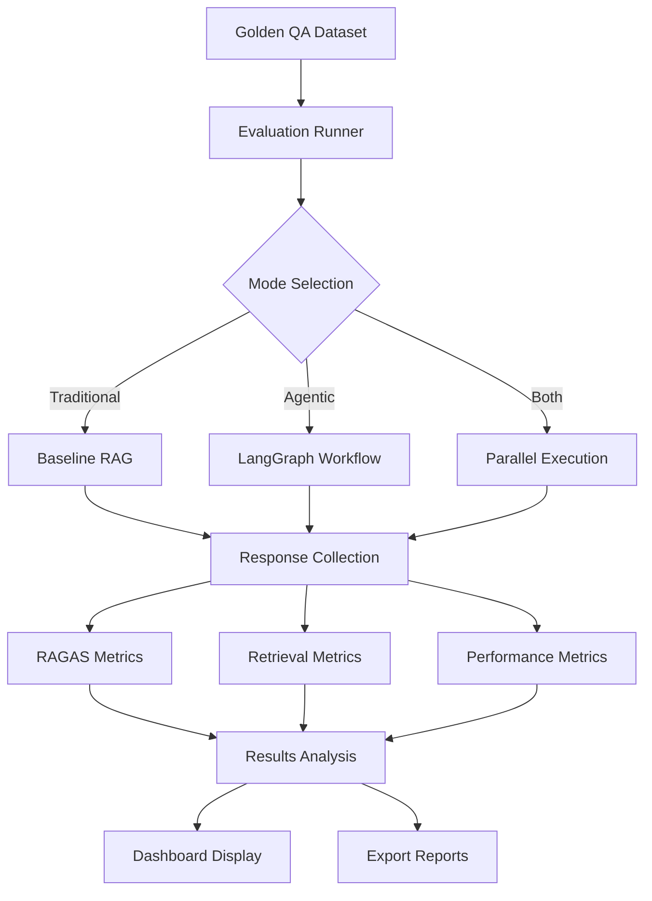

# MAI Storage - Evaluation Framework

**Version**: Phase 12 Complete  
**Last Updated**: January 2025  
**Framework**: RAGAS + Custom Retrieval Metrics

## Overview

The MAI Storage evaluation framework provides comprehensive quality assessment for both Traditional and Agentic RAG systems. Built on RAGAS (RAG Assessment) metrics and enhanced with custom retrieval evaluation, the framework enables systematic comparison, regression detection, and performance optimization.

## Table of Contents

1. [Evaluation Architecture](#evaluation-architecture)
2. [Metrics Framework](#metrics-framework)
3. [Running Evaluations](#running-evaluations)
4. [Results Analysis](#results-analysis)
5. [Golden Dataset](#golden-dataset)
6. [Comparison Studies](#comparison-studies)
7. [Performance Benchmarks](#performance-benchmarks)
8. [Advanced Configuration](#advanced-configuration)

---

## Evaluation Architecture

### Components Overview

```
services/rag_api/eval/
├── run_ragas.py           # Main evaluation runner
├── __init__.py            # Package initialization
└── golden_qa.json         # Reference Q&A dataset

Integration Points:
├── /apps/web/pages/eval.js    # Web dashboard
├── /services/rag_api/main.py  # API endpoints  
└── /Makefile                  # Command shortcuts
```

### Evaluation Pipeline



---

## Metrics Framework

### RAGAS Metrics

#### 1. Faithfulness
**Purpose**: Measures how factually accurate the generated answer is compared to the retrieved context.

**Calculation**: LLM-based evaluation checking for hallucinations and unsupported claims.

**Target Score**: > 0.85
```python
# Example faithfulness check
{
  "question": "What is the capital of France?",
  "answer": "Paris is the capital of France, located in northern Europe.",
  "context": ["Paris is the capital and largest city of France..."],
  "faithfulness_score": 0.92  # High - no hallucinations
}
```

#### 2. Answer Relevancy
**Purpose**: Evaluates how well the generated answer addresses the original question.

**Calculation**: Semantic similarity between question and answer using embeddings.

**Target Score**: > 0.80
```python
# Example relevancy assessment
{
  "question": "How does machine learning work?",
  "answer": "Machine learning uses algorithms to learn patterns...",
  "relevancy_score": 0.88  # High - directly addresses question
}
```

#### 3. Context Precision
**Purpose**: Measures the proportion of relevant context chunks in the retrieved set.

**Calculation**: Relevant chunks / Total retrieved chunks

**Target Score**: > 0.75
```python
# Example precision calculation
{
  "question": "Explain neural networks",
  "retrieved_chunks": 10,
  "relevant_chunks": 8,
  "context_precision": 0.80  # 8/10 = 80% relevant
}
```

#### 4. Context Recall
**Purpose**: Evaluates if all necessary information to answer the question was retrieved.

**Calculation**: Retrieved relevant info / Total required info (from ground truth)

**Target Score**: > 0.70
```python
# Example recall assessment
{
  "question": "What are the types of neural networks?",
  "required_concepts": ["CNN", "RNN", "Transformer", "MLP"],
  "retrieved_concepts": ["CNN", "RNN", "Transformer"],
  "context_recall": 0.75  # 3/4 = 75% coverage
}
```

### Custom Retrieval Metrics

#### 1. Recall@k
**Purpose**: Measures the proportion of relevant documents retrieved in top-k results.

**Calculation**: Relevant docs in top-k / Total relevant docs

**Target Scores**:
- Recall@5: > 0.70
- Recall@10: > 0.85

```python
# Example recall calculation
{
  "query": "transformer architecture",
  "relevant_doc_ids": ["doc_1", "doc_3", "doc_7", "doc_12"],
  "retrieved_top_10": ["doc_1", "doc_2", "doc_3", "doc_4", ...],
  "recall_at_10": 0.75  # 3 out of 4 relevant docs found
}
```

#### 2. nDCG@k (Normalized Discounted Cumulative Gain)
**Purpose**: Evaluates ranking quality considering both relevance and position.

**Calculation**: DCG@k / IDCG@k (ideal ranking)

**Target Scores**:
- nDCG@5: > 0.70
- nDCG@10: > 0.75

```python
# Example nDCG calculation
{
  "query": "deep learning applications",
  "retrieved_docs": [
    {"id": "doc_1", "relevance": 3, "position": 1},  # Highly relevant, top position
    {"id": "doc_2", "relevance": 1, "position": 2},  # Somewhat relevant
    {"id": "doc_3", "relevance": 3, "position": 3}   # Highly relevant, lower position
  ],
  "ndcg_at_10": 0.78
}
```

#### 3. MRR (Mean Reciprocal Rank)
**Purpose**: Measures the rank of the first relevant result.

**Calculation**: 1 / Rank of first relevant result

**Target Score**: > 0.70

```python
# Example MRR calculation
{
  "query": "machine learning definition",
  "first_relevant_position": 2,  # Second result is first relevant
  "mrr": 0.50  # 1/2 = 0.50
}
```

### Performance Metrics

#### 1. Response Time Distribution
- **P50 Latency**: Median response time
- **P95 Latency**: 95th percentile response time
- **P99 Latency**: 99th percentile response time

```python
# Target performance (milliseconds)
traditional_rag = {
  "p50": 400,   # Target: < 400ms
  "p95": 800,   # Target: < 800ms
  "p99": 1200   # Target: < 1200ms
}

agentic_rag = {
  "p50": 1200,  # Target: < 1200ms
  "p95": 2500,  # Target: < 2500ms  
  "p99": 4000   # Target: < 4000ms
}
```

#### 2. Token Usage Analysis
- **Input Tokens**: Context and prompt token consumption
- **Output Tokens**: Generated response token count
- **Cost Analysis**: Estimated API costs per query

#### 3. Resource Utilization
- **Memory Usage**: Peak memory consumption during evaluation
- **CPU Usage**: Processing time per query component
- **Cache Hit Rates**: Effectiveness of caching layers

---

## Running Evaluations

### Command Line Interface

#### Basic Evaluation
```bash
# Run evaluation on golden dataset
make eval-run

# Run specific mode only  
make eval-traditional     # Traditional RAG only
make eval-agentic        # Agentic RAG only
make eval-compare        # Both modes with comparison

# Custom dataset evaluation
cd services/rag_api/eval
python run_ragas.py --golden_qa_path custom_qa.json --output_dir ./results
```

#### Advanced Options
```bash
# Full evaluation with custom parameters
python run_ragas.py \
  --golden_qa_path ../golden_qa.json \
  --output_dir ./results \
  --run_traditional \
  --run_agentic \
  --compare \
  --top_k 10 \
  --max_refinements 2 \
  --enable_verification \
  --export_format json,csv,html

# Performance benchmarking
python run_ragas.py \
  --benchmark_mode \
  --concurrent_queries 5 \
  --iterations 100 \
  --measure_resources
```

### Web Dashboard Evaluation

#### Access & Setup
1. **Navigate**: Go to http://localhost:3000/eval
2. **Configure**: Select evaluation parameters
3. **Run**: Click "Start Evaluation" button
4. **Monitor**: Watch real-time progress
5. **Analyze**: Review results and comparisons

#### Dashboard Features
- **Real-time Progress**: Live updates during evaluation
- **Interactive Charts**: RAGAS scores, performance metrics
- **Comparison Views**: Traditional vs Agentic side-by-side
- **Export Options**: Download results in multiple formats
- **Historical Trends**: Track performance over time

### API Endpoints

#### Evaluation Endpoints
```bash
# Run evaluation via API
POST /api/eval/run
{
  "mode": "both",           # "traditional", "agentic", "both"
  "dataset_path": "golden_qa.json",
  "top_k": 10,
  "max_refinements": 2,
  "export_format": ["json", "csv"]
}

# Get evaluation results
GET /api/eval/results/{evaluation_id}

# Compare evaluation runs
GET /api/eval/compare?run1={id1}&run2={id2}

# Performance benchmarks
GET /api/eval/benchmarks?timeframe=7d
```

---

## Results Analysis

### Output Formats

#### JSON Results
```json
{
  "evaluation_id": "eval_20250127_143022",
  "timestamp": "2025-01-27T14:30:22Z",
  "dataset": "golden_qa.json",
  "total_questions": 20,
  "modes_evaluated": ["traditional", "agentic"],
  
  "traditional_results": {
    "ragas_scores": {
      "faithfulness": 0.87,
      "answer_relevancy": 0.82,
      "context_precision": 0.78,
      "context_recall": 0.74
    },
    "retrieval_metrics": {
      "recall_at_5": 0.71,
      "recall_at_10": 0.86,
      "ndcg_at_5": 0.72,
      "ndcg_at_10": 0.76,
      "mrr": 0.73
    },
    "performance": {
      "avg_response_time_ms": 420,
      "p95_response_time_ms": 780,
      "avg_tokens_used": 1250,
      "total_cost_usd": 0.045
    }
  },
  
  "agentic_results": {
    "ragas_scores": {
      "faithfulness": 0.91,
      "answer_relevancy": 0.88,
      "context_precision": 0.82,
      "context_recall": 0.79
    },
    "retrieval_metrics": {
      "recall_at_5": 0.76,
      "recall_at_10": 0.89,
      "ndcg_at_5": 0.78,
      "ndcg_at_10": 0.81,
      "mrr": 0.77
    },
    "performance": {
      "avg_response_time_ms": 1350,
      "p95_response_time_ms": 2200,
      "avg_tokens_used": 2180,
      "total_cost_usd": 0.078,
      "avg_refinements": 0.3,
      "verification_pass_rate": 0.85
    }
  },
  
  "comparison": {
    "quality_improvement": {
      "faithfulness": "+4.6%",
      "answer_relevancy": "+7.3%",
      "context_precision": "+5.1%",
      "context_recall": "+6.8%"
    },
    "performance_tradeoff": {
      "response_time": "+221%",
      "token_usage": "+74%",
      "cost": "+73%"
    }
  }
}
```

#### CSV Export
```csv
question_id,question,mode,faithfulness,answer_relevancy,context_precision,context_recall,response_time_ms,tokens_used
Q001,"What is machine learning?",traditional,0.89,0.85,0.80,0.76,380,1150
Q001,"What is machine learning?",agentic,0.92,0.90,0.85,0.82,1280,1980
Q002,"Explain neural networks",traditional,0.85,0.78,0.75,0.71,420,1320
Q002,"Explain neural networks",agentic,0.90,0.86,0.81,0.77,1450,2150
```

### Quality Analysis

#### RAGAS Score Interpretation
```python
# Quality tier classification
def classify_quality(score):
    if score >= 0.90:   return "Excellent"
    elif score >= 0.80: return "Good" 
    elif score >= 0.70: return "Acceptable"
    else:               return "Needs Improvement"

# Typical score ranges by system maturity
maturity_benchmarks = {
    "prototype": {"faithfulness": 0.70, "relevancy": 0.65},
    "development": {"faithfulness": 0.80, "relevancy": 0.75},
    "production": {"faithfulness": 0.85, "relevancy": 0.80},
    "optimized": {"faithfulness": 0.90, "relevancy": 0.85}
}
```

#### Retrieval Quality Assessment
```python
# Retrieval effectiveness classification
def assess_retrieval(recall_at_10, ndcg_at_10):
    if recall_at_10 >= 0.85 and ndcg_at_10 >= 0.75:
        return "High Quality"
    elif recall_at_10 >= 0.75 and ndcg_at_10 >= 0.65:
        return "Good Quality"
    elif recall_at_10 >= 0.65 and ndcg_at_10 >= 0.55:
        return "Acceptable Quality"
    else:
        return "Poor Quality"
```

### Performance Analysis

#### Latency Benchmarking
```python
# Performance tier classification
def classify_performance(p95_latency_ms, mode):
    if mode == "traditional":
        if p95_latency_ms <= 800:    return "Excellent"
        elif p95_latency_ms <= 1200: return "Good"
        elif p95_latency_ms <= 2000: return "Acceptable"
        else:                        return "Poor"
    
    elif mode == "agentic":
        if p95_latency_ms <= 2500:   return "Excellent"
        elif p95_latency_ms <= 4000: return "Good"
        elif p95_latency_ms <= 6000: return "Acceptable"
        else:                        return "Poor"
```

#### Cost Analysis
```python
# Cost effectiveness calculation
def calculate_cost_effectiveness(quality_score, cost_per_query):
    """Quality points per dollar spent."""
    return quality_score / cost_per_query

# Example cost comparison
traditional_efficiency = calculate_cost_effectiveness(0.82, 0.045)  # 18.2
agentic_efficiency = calculate_cost_effectiveness(0.88, 0.078)      # 11.3

# Agentic RAG provides 7.3% better quality for 73% higher cost
quality_premium = (0.88 - 0.82) / 0.82 * 100  # +7.3%
cost_premium = (0.078 - 0.045) / 0.045 * 100   # +73%
```

---

## Golden Dataset

### Dataset Structure

#### Question Categories
```yaml
Categories:
  - factual_simple:      "What is the capital of France?"
  - factual_complex:     "Compare the economic systems of..."
  - analytical:          "Why did the Roman Empire fall?"
  - comparative:         "Contrast machine learning and deep learning"
  - multi_hop:           "How does climate change affect biodiversity?"
  - ambiguous:           "What does AI mean in different contexts?"
  - out_of_domain:       "Questions not covered in corpus"
```

#### Sample Golden QA Entry
```json
{
  "id": "Q001",
  "category": "factual_complex",
  "question": "What are the key differences between supervised and unsupervised machine learning?",
  "context_requirements": [
    "supervised learning definition",
    "unsupervised learning definition", 
    "key differences and examples",
    "use cases for each approach"
  ],
  "expected_answer_elements": [
    "Supervised learning uses labeled training data",
    "Unsupervised learning finds patterns in unlabeled data",
    "Examples: classification vs clustering",
    "Use cases: prediction vs exploration"
  ],
  "difficulty": "medium",
  "expected_sources": ["ml_textbook.pdf", "ai_handbook.md"],
  "ground_truth_answer": "Supervised learning algorithms...",
  "evaluation_notes": "Should cover both definitions and provide clear examples"
}
```

### Dataset Creation Guidelines

#### Question Design Principles
1. **Clarity**: Questions should be unambiguous and well-formed
2. **Coverage**: Span different difficulty levels and question types
3. **Relevance**: Align with actual user query patterns
4. **Verifiability**: Ground truth answers must be verifiable from corpus
5. **Diversity**: Include various domains and complexity levels

#### Quality Assurance Process
```python
# Validation checklist for golden QA
def validate_golden_qa_entry(entry):
    checks = {
        "has_clear_question": bool(entry.get("question", "").strip()),
        "has_ground_truth": bool(entry.get("ground_truth_answer", "").strip()),
        "has_category": entry.get("category") in VALID_CATEGORIES,
        "has_context_reqs": len(entry.get("context_requirements", [])) > 0,
        "answer_length_ok": 50 <= len(entry.get("ground_truth_answer", "")) <= 2000,
        "sources_specified": len(entry.get("expected_sources", [])) > 0
    }
    return all(checks.values()), checks
```

---

## Comparison Studies

### Traditional vs Agentic RAG

#### Quality Comparison
```python
# Typical performance differences
quality_improvements = {
    "faithfulness": +0.04,      # +4.6% - Better fact verification
    "answer_relevancy": +0.06,  # +7.3% - More targeted responses  
    "context_precision": +0.04, # +5.1% - Better source selection
    "context_recall": +0.05     # +6.8% - More comprehensive coverage
}

# Statistical significance testing
from scipy.stats import ttest_rel

def compare_modes(traditional_scores, agentic_scores):
    """Compare mode performance with statistical testing."""
    t_stat, p_value = ttest_rel(traditional_scores, agentic_scores)
    
    improvement = np.mean(agentic_scores) - np.mean(traditional_scores)
    percent_change = (improvement / np.mean(traditional_scores)) * 100
    
    return {
        "improvement": improvement,
        "percent_change": percent_change,
        "p_value": p_value,
        "significant": p_value < 0.05
    }
```

#### Use Case Recommendations
```yaml
Traditional RAG Best For:
  - Simple factual questions
  - Speed-critical applications
  - Cost-sensitive scenarios
  - High-volume queries
  - Well-defined domains

Agentic RAG Best For:
  - Complex multi-part questions
  - Research and analysis tasks
  - Quality-critical applications
  - Ambiguous or open-ended queries
  - Cross-domain synthesis
```

### Ablation Studies

#### Component Impact Analysis
```python
# Isolate impact of individual components
ablation_configs = {
    "baseline": {"rerank": False, "mmr": False, "verification": False},
    "+rerank": {"rerank": True, "mmr": False, "verification": False},
    "+mmr": {"rerank": True, "mmr": True, "verification": False},
    "+verification": {"rerank": True, "mmr": True, "verification": True}
}

# Typical component contributions
component_impact = {
    "reranking": +0.03,        # +3% quality improvement
    "mmr_diversity": +0.02,    # +2% quality improvement  
    "verification": +0.04,     # +4% quality improvement
    "combined": +0.09          # +9% total improvement
}
```

---

## Performance Benchmarks

### Baseline Performance Targets

#### Quality Targets
```yaml
Production Quality Thresholds:
  faithfulness: >= 0.85
  answer_relevancy: >= 0.80
  context_precision: >= 0.75
  context_recall: >= 0.70
  
  recall_at_10: >= 0.85
  ndcg_at_10: >= 0.75
  mrr: >= 0.70
```

#### Performance Targets
```yaml
Traditional RAG:
  p50_latency_ms: <= 400
  p95_latency_ms: <= 800
  p99_latency_ms: <= 1200
  
Agentic RAG:
  p50_latency_ms: <= 1200
  p95_latency_ms: <= 2500
  p99_latency_ms: <= 4000
```

#### Resource Targets
```yaml
Memory Usage:
  api_server: <= 2GB
  per_request: <= 100MB
  
CPU Usage:
  baseline: <= 50%
  peak: <= 80%
  
Cache Performance:
  hit_rate: >= 80%
  miss_penalty: <= 2x
```

### Load Testing

#### Concurrent User Simulation
```python
# Load testing configuration
load_test_config = {
    "concurrent_users": [1, 5, 10, 25, 50],
    "queries_per_user": 10,
    "query_distribution": {
        "simple": 0.4,      # 40% simple factual questions
        "medium": 0.4,      # 40% medium complexity
        "complex": 0.2      # 20% complex multi-hop questions
    },
    "think_time_seconds": 5,  # Delay between user queries
    "ramp_up_time": 60       # Gradual user onboarding
}

# Performance degradation analysis
def analyze_performance_degradation(results):
    """Analyze how performance degrades with load."""
    baseline = results[1]  # Single user performance
    
    degradation = {}
    for users, metrics in results.items():
        degradation[users] = {
            "latency_increase": metrics["p95"] / baseline["p95"],
            "throughput_ratio": metrics["qps"] / baseline["qps"],
            "error_rate": metrics["errors"] / metrics["total_requests"]
        }
    
    return degradation
```

### Regression Testing

#### Automated Performance Monitoring
```python
# Performance regression detection
def detect_performance_regression(current_results, baseline_results, threshold=0.1):
    """Detect if current performance significantly degrades from baseline."""
    
    regressions = []
    
    for metric in ["faithfulness", "answer_relevancy", "p95_latency"]:
        current_value = current_results[metric]
        baseline_value = baseline_results[metric]
        
        if metric == "p95_latency":
            # For latency, increase is bad
            change = (current_value - baseline_value) / baseline_value
            if change > threshold:
                regressions.append({
                    "metric": metric,
                    "change": change,
                    "current": current_value,
                    "baseline": baseline_value,
                    "status": "regression"
                })
        else:
            # For quality metrics, decrease is bad
            change = (baseline_value - current_value) / baseline_value
            if change > threshold:
                regressions.append({
                    "metric": metric,
                    "change": -change,  # Negative for decrease
                    "current": current_value,
                    "baseline": baseline_value,
                    "status": "regression"
                })
    
    return regressions
```

---

## Advanced Configuration

### Custom Evaluation Metrics

#### Domain-Specific Metrics
```python
# Custom metric for technical accuracy
def technical_accuracy_score(answer, technical_terms, context):
    """Evaluate technical term usage accuracy."""
    
    used_terms = extract_technical_terms(answer)
    correct_usage = 0
    
    for term in used_terms:
        if term in technical_terms:
            # Check if term is used correctly based on context
            if validate_term_usage(term, answer, context):
                correct_usage += 1
    
    return correct_usage / len(used_terms) if used_terms else 0

# Custom metric for citation quality  
def citation_quality_score(answer, citations, sources):
    """Evaluate quality and accuracy of citations."""
    
    scores = []
    for citation in citations:
        # Check if citation supports the claim
        support_score = evaluate_citation_support(citation, sources)
        
        # Check citation specificity (page numbers, sections)
        specificity_score = evaluate_citation_specificity(citation)
        
        # Combined citation quality
        quality = 0.7 * support_score + 0.3 * specificity_score
        scores.append(quality)
    
    return np.mean(scores) if scores else 0
```

### Multi-Model Evaluation

#### Comparing Different LLMs
```python
# Multi-model evaluation configuration
model_configs = {
    "gpt-4o-mini": {
        "model": "gpt-4o-mini",
        "temperature": 0.7,
        "max_tokens": 4096
    },
    "gpt-4": {
        "model": "gpt-4",
        "temperature": 0.7,
        "max_tokens": 4096
    },
    "claude-3-sonnet": {
        "model": "claude-3-sonnet-20240229",
        "temperature": 0.7,
        "max_tokens": 4096
    }
}

def run_multi_model_evaluation(question_set, models):
    """Compare performance across different LLMs."""
    
    results = {}
    for model_name, config in models.items():
        print(f"Evaluating {model_name}...")
        
        # Initialize model-specific RAG system
        rag_system = create_rag_system(config)
        
        # Run evaluation
        model_results = evaluate_rag_system(rag_system, question_set)
        results[model_name] = model_results
    
    return compare_model_results(results)
```

### Continuous Evaluation

#### CI/CD Integration
```yaml
# .github/workflows/evaluation.yml
name: Continuous Evaluation

on:
  push:
    branches: [main]
  pull_request:
    branches: [main]
  schedule:
    - cron: "0 2 * * *"  # Daily at 2 AM

jobs:
  evaluate:
    runs-on: ubuntu-latest
    steps:
      - uses: actions/checkout@v3
      
      - name: Setup Environment
        run: |
          make setup
          make start-infra
      
      - name: Run Evaluation
        run: |
          make eval-run
        env:
          OPENAI_API_KEY: ${{ secrets.OPENAI_API_KEY }}
      
      - name: Check Performance Regression
        run: |
          python scripts/check_regression.py \
            --current results/latest.json \
            --baseline results/baseline.json \
            --threshold 0.05
      
      - name: Upload Results
        uses: actions/upload-artifact@v3
        with:
          name: evaluation-results
          path: results/
```

---

This evaluation framework provides comprehensive quality assessment capabilities, enabling systematic optimization and quality assurance for both Traditional and Agentic RAG systems in the MAI Storage platform.
