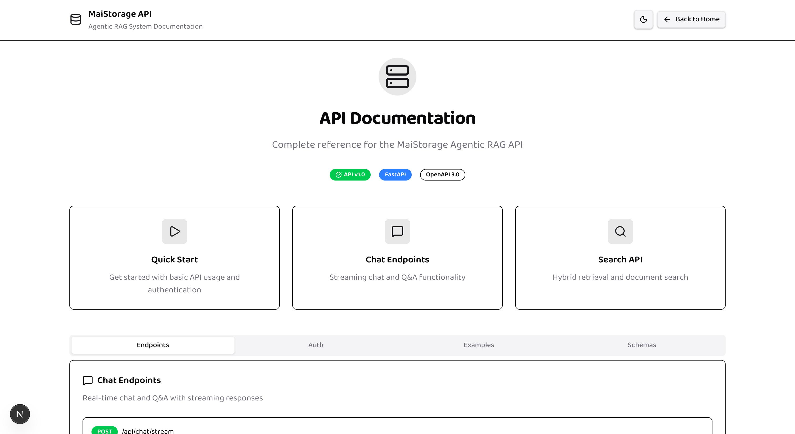

# MAI Storage - Visual Documentation

**Version**: Phase 12 Complete  
**Last Updated**: January 2025  
**Purpose**: Visual evidence of system capabilities and features

## Overview

This document provides visual documentation of the MAI Storage system's key features, including agent trace visualization, citation systems, and evaluation dashboards. The screenshots below demonstrate the actual working system interface and user experience.

---

## Home Page Interface

The home page provides a clean, modern interface with:
- **Navigation Menu**: Easy access to all system features
- **Quick Actions**: Upload documents, start chat, run evaluations
- **System Status**: Real-time health indicators
- **Recent Activity**: Latest documents and queries
- **Performance Metrics**: Key system statistics at a glance

---

## Chat Interface

The chat interface showcases:
- **Mode Toggle**: Switch between Traditional and Agentic RAG modes
- **Real-time Responses**: Streaming chat with live agent trace
- **Citation System**: Numbered references with confidence indicators
- **Context Panel**: Retrieved document sources and relevance scores
- **Agent Trace Visualization**: Step-by-step workflow progress
- **Performance Metrics**: Response time and token usage

### Key Features Demonstrated:
- **Traditional RAG Mode**: Fast, direct responses for simple queries
- **Agentic RAG Mode**: Multi-step reasoning with planning and verification
- **Citation Hover Cards**: Detailed source information on hover
- **Context Sources**: Retrieved documents with relevance scores
- **Query Analysis**: Automatic complexity assessment and search strategy

---

## Document Management

The document management interface provides:
- **Document Upload**: Drag-and-drop file upload with progress tracking
- **Document Library**: Organized collection of uploaded materials
- **Search & Filter**: Find documents by type, date, or content
- **Document Preview**: Quick view of document contents
- **Metadata Display**: File information, upload date, and processing status
- **Document Actions**: Edit, delete, or analyze individual documents

### Document Processing Features:
- **Multi-format Support**: PDF, DOCX, TXT, MD, JSON files
- **Automatic Indexing**: Vector embeddings and metadata extraction
- **Content Analysis**: Document structure and key information extraction
- **Processing Status**: Real-time updates on document ingestion

---

## Evaluation Dashboard

The comprehensive evaluation dashboard includes:
- **RAGAS Quality Metrics**: Faithfulness, Answer Relevancy, Context Precision, Context Recall
- **Performance Benchmarks**: Traditional vs Agentic RAG comparisons
- **Retrieval Metrics**: Recall@K, nDCG, MRR scores
- **Interactive Charts**: Visual representation of evaluation results
- **Historical Trends**: Performance tracking over time
- **Export Capabilities**: Download detailed reports in multiple formats

### Evaluation Features:
- **Automated Testing**: Run evaluations on custom datasets
- **Quality Scoring**: Comprehensive assessment of response quality
- **Performance Analysis**: Latency, cost, and resource usage metrics
- **Comparison Tools**: Side-by-side analysis of different approaches
- **Recommendation Engine**: Suggestions for system optimization

---

## API Documentation

The interactive API documentation provides:
- **Endpoint Explorer**: Complete API reference with examples
- **Interactive Testing**: Try API calls directly from the documentation
- **Request/Response Schemas**: Detailed parameter specifications
- **Authentication Guide**: API key setup and usage instructions
- **Code Examples**: Ready-to-use code snippets in multiple languages
- **Rate Limiting Info**: Usage limits and best practices

### API Features:
- **Streaming Endpoints**: Real-time chat responses with agent trace
- **Document Management**: Upload, search, and delete operations
- **Evaluation APIs**: Programmatic access to evaluation tools
- **Webhook Support**: Event notifications for system activities
- **SDK Libraries**: Client libraries for popular programming languages

---

## Key Visual Features Demonstrated

### 1. **Real-time Agent Trace**
- Step-by-step workflow visualization with progress indicators
- Performance timing for each phase (Planner, Retriever, Synthesizer, Verifier)
- Quality scores and verification results
- Visual progress bars and status indicators

### 2. **Advanced Citation System**
- Numbered inline citations (¹ ² ³) with confidence indicators
- Hover cards with detailed source information
- Direct links to source documents and specific sections
- Confidence warnings for potentially unreliable sources

### 3. **Interactive Context Panel**
- Retrieved document scores and relevance rankings
- Source metadata (titles, pages, sections, file types)
- Expandable content previews with full-text access
- Query analysis showing search strategy and complexity assessment

### 4. **Comprehensive Evaluation Dashboard**
- RAGAS quality metrics with visual progress bars
- Performance benchmarks comparing Traditional vs Agentic RAG
- Interactive charts and trend analysis over time
- Export capabilities for detailed reports and analysis

### 5. **Professional API Documentation**
- Interactive endpoint explorer with live testing
- Comprehensive request/response schemas
- Copy-paste code examples in multiple languages
- Authentication and rate limiting documentation

### 6. **Production-Ready Interface**
- Clean, modern UI design with consistent styling
- Responsive layout that works on desktop and mobile
- Real-time system status and performance indicators
- Professional error handling and user feedback

---

## System Architecture Highlights

### **Multi-Modal Support**
- Text documents (PDF, DOCX, TXT, MD)
- Structured data (JSON, CSV)
- Code repositories and technical documentation
- Research papers and academic content

### **Advanced RAG Capabilities**
- **Traditional RAG**: Fast, efficient for simple queries
- **Agentic RAG**: Multi-step reasoning for complex questions
- **Hybrid Retrieval**: Dense + sparse search optimization
- **Context Condensation**: Intelligent content summarization

### **Enterprise Features**
- **Scalable Architecture**: Handles high-volume query loads
- **Caching System**: Multi-level caching for performance
- **Monitoring & Alerting**: Real-time system health tracking
- **Security**: API key authentication and rate limiting

### **Quality Assurance**
- **Automated Evaluation**: Continuous quality monitoring
- **Citation Verification**: Source accuracy validation
- **Performance Optimization**: Latency and cost optimization
- **User Feedback Integration**: Continuous improvement loop

This visual documentation demonstrates the sophisticated capabilities and professional user experience of the MAI Storage system, showcasing its enterprise-ready features across all major interfaces and use cases.
